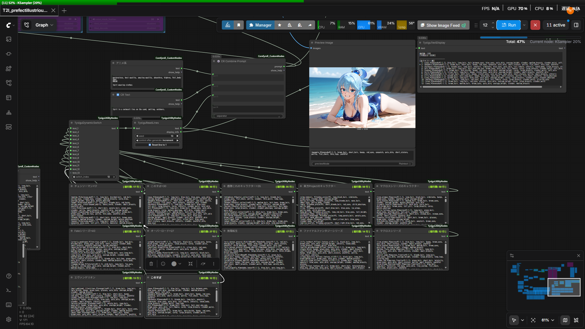
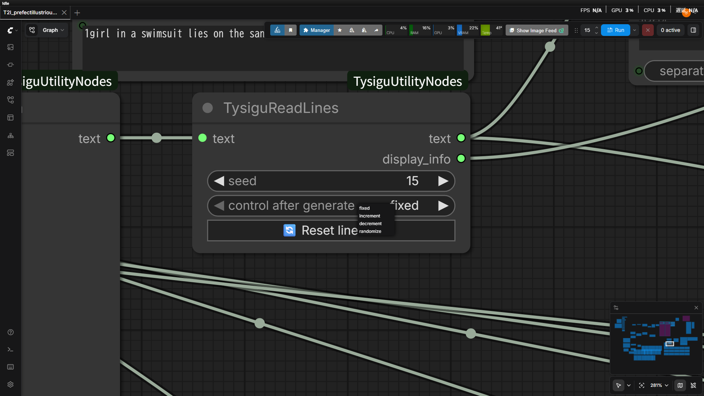
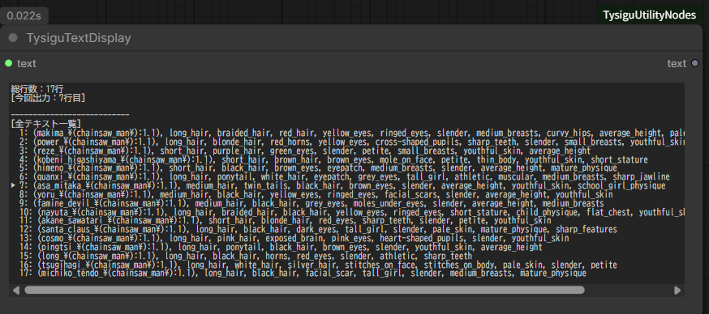
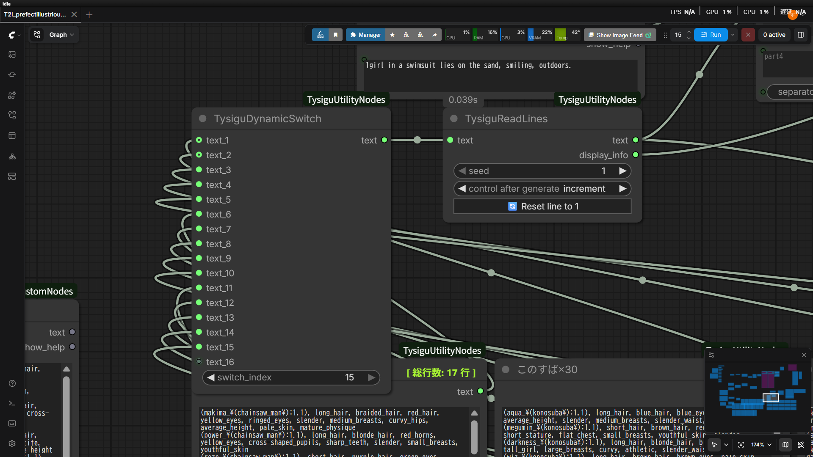
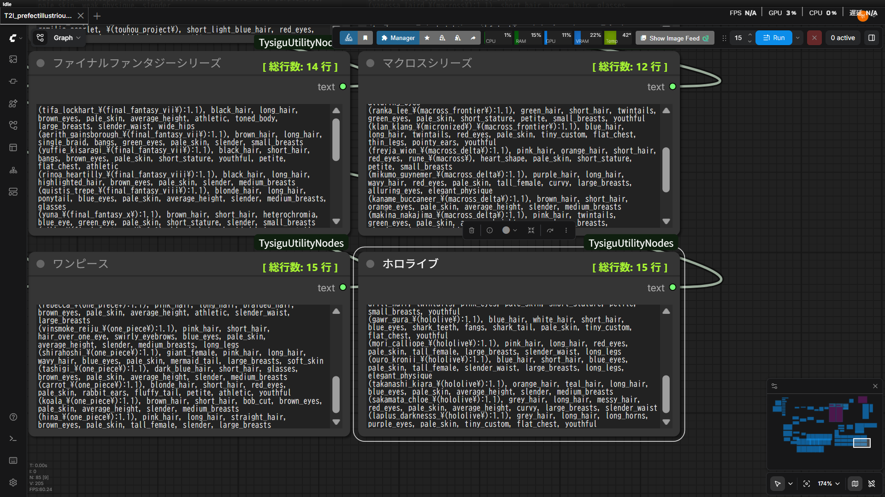

# 🚀 ComfyUI Tysigu Utility Nodes

[]()
[]()



**[ComfyUI](https://github.com/comfyanonymous/ComfyUI)** 用の高機能なカスタムノード群です。  
テキストの行ごとの読み込み、進行状況の可視化、入力の切り替えを、**スパゲッティのような複雑な配線なし**でエレガントに管理するために設計されました。

> **[EN]** A collection of highly functional custom nodes for ComfyUI. Designed to elegantly manage line-by-line text reading, visual progression display, and dynamic inputs without the mess of spaghetti wiring!

---

## ✨ Features / 機能紹介

配線が絡まるストレスや、既存ノードの「強制的すぎる仕様」に対するジレンマを一気に解決する便利ツール群です。

複数行のテキスト（プロンプト）をバッチ処理する際、以下のような柔軟で思い通りのコントロールを可能にします。
*   **指定の行番号から読み込みを始めて連続実行する**
*   **行を意図的に進めたり戻したりする**
*   **特定の行で固定する（同じプロンプトでガチャを回す）**

これらのノードを使えば、現在の処理の進行状況を画面上で直感的に可視化し、テキスト入力の切り替えもノードの繋ぎ変えなしで一瞬で行えます！

> **[EN]** Tools designed to instantly resolve the stress of tangled wires and the dilemma of "forced sequential reading" in existing nodes.  
> When processing multi-line texts (prompts) in batches, it enables flexible and precise control such as:
> *   **Start reading from a specific line number and execute sequentially.**
> *   **Intentionally advance or return to previous lines.**
> *   **Fix at a specific line (useful for 'gacha' rerolling with the same prompt).**
> 
> With these nodes, you can visually track your current processing progress directly on the screen and switch text inputs instantly without reconnecting nodes!

---

### 📖 1. TysiguReadLines

<p align="center">
  <a href="assets/smart_reader.png">
    
  </a>
</p>

複数行のプロンプトリストから、テキストを順番（または指定箇所で固定）に読み込む次世代のリーダーノードです。  
既存のリーダーノードにありがちな「次は絶対に次の行しか読まない」という不便さを解消しました。

*   🎯 **行の固定（ガチャ用）**: 特定の行（キャラや構図）に固定して生成結果を厳選（ガチャ）するのに最適です。
*   ⚙️ **柔軟な自動進行**: はじめの行を指定すれば、あとは自動で順番に次の行へと進んでくれます。
*   🔁 **自動ループ**: 最後の行まで到達したら、エラーで止まることなく自動で最初の行へ戻ってループします。

> **[EN]** Reads a multi-line prompt list sequentially or holds on a fixed line. Solves the inconvenience of existing reader nodes.
> *   🎯 **Fixed Line for 'Gacha'**: Perfect for locking onto a specific line (character/composition) and rerolling generations.
> *   ⚙️ **Flexible Progressive Batch**: Set a starting line and let it automatically proceed sequentially through the queue.
> *   🔁 **Auto-Loop**: Automatically returns to the first line upon reaching the end of the list without triggering errors.

---

### 🖥️ 2. TysiguTextDisplay

<p align="center">
  <a href="assets/text_display.png">
    
  </a>
</p>

処理の進行状況がブラックボックスになるのを防ぐ、**可視化特化のディスプレイノード**です。  
以下のような情報が、ノード上のUIに直接、美しく一覧表示されます。

*   📊 **総行数が何行あるか**
*   🚨 **今は何行目の処理を行っているか**
*   📝 **どんなテキスト（プロンプト）内容が送信されているか**

💡 **【便利ポイント】**  
現在の行番号や内容がハッキリと分かるため、「何行目から何行目だけを重点的に繰り返したい」「狙ったキャラを出すためにこの行に固定しよう」といった用途において、非常に直感的で調整しやすくなります！

> **[EN]** A visually-focused display node that prevents your progress from becoming a black box. The following information is beautifully listed directly on the node UI:
> *   📊 **Total number of lines**
> *   🚨 **Which line is currently being processed**
> *   📝 **What exact text (prompt) is currently being sent**
> 
> 💡 **[Pro Tip]** By clearly seeing the current line number and content, it becomes highly intuitive to make adjustments like "I want to focus on repeating lines X to Y" or "Let's lock onto this line to nail this specific character!".

---

### 🔀 3. TysiguDynamicSwitch

<p align="center">
  <a href="assets/dynamic_switch.png">
    
  </a>
</p>

複数の入力（別々のキャラリストなど）を切り替える際、毎回わずらわしいケーブルの繋ぎ変えをする必要が完全にゼロになります！

*   👉 **直感的な操作**: ノード上の `switch_index` の数値を変更するだけで、複数ある入力の中から使いたいものを一つ選択（切り替え）できます。
*   ♾️ **高い拡張性**: ノードに繋ぐピン（入力ソケット）はご自身の使用数に合わせてどんどん増やせます。プログラム内部の処理上は最大999個の枠を探せるよう安全マージンを取って設計されているため、大量のリストを接続してもエラーで落ちるリスクがなく安心です。

> **[EN]** Eliminates the need for annoying cable rewiring when switching between multiple inputs!
> *   👉 **Intuitive Operation**: Select and switch between multiple inputs simply by changing the `switch_index` value on the node.
> *   ♾️ **High Scalability**: You can keep adding input sockets (pins) as needed. The internal program is safely designed with a margin to search up to 999 slots, completely eliminating the risk of crashing even when connecting a massive number of lists.

---

### 📥 4. TysiguTextInput

<p align="center">
  <a href="assets/text_input.png">
    
  </a>
</p>

複数行のプロンプトやテキストデータを一つのノード内でシンプルに管理・入力するためのテキストノードです。

💡 **【最大の強み: キュー（Batch）数の即座な把握】**  
テキストを入力するだけで、ノード上に「このリストの総行数が何行あるか」が自動表示されます。これにより、以下の判断が一目でつくようになります。
*   **「バッチカウント（Queueの数）をいくつに設定すればリストを一回り（全生成）できるか」**

わざわざプロンプトの行数を手動で数える必要がなくなり、計算ミスや確認のストレスが一切なくなります！

> **[EN]** A convenient text node designed for cleanly managing and inputting multi-line prompts all within a single location.
> 
> 💡 **[Biggest Strength: Instant Batch Queue Assessment]**
> When you input text, it automatically displays "the total number of lines in this list". This allows you to judge at a glance exactly how many ComfyUI Batch Counts (Queue instances) you need to set to complete one full cycle of all prompts. It completely eliminates the stress of miscalculation and manual checking!

---

## 🛠️ Installation / インストール方法

1. Navigate to your ComfyUI `custom_nodes` directory:
   ```bash
   cd ComfyUI/custom_nodes
   ```
2. Clone this repository (or download it and extract to a folder):
   ```bash
   git clone https://github.com/YourUsername/ComfyUI-TysiguUtilityNodes.git
   ```
3. Restart ComfyUI. The nodes will be available under the `TysiguUtilityNodes` category.

---

## 💡 Usage / 使い方

ComfyUIのキャンバス上で **右クリック > `Add Node` > `TysiguUtilityNodes`** のカテゴリーから各ノードを追加してご使用ください。  

> **⚡ Pro Tip:** 
> ノードの検索窓（Search）で **`ty`** と入力すると、これらのノードを最速で呼び出すことができます！
